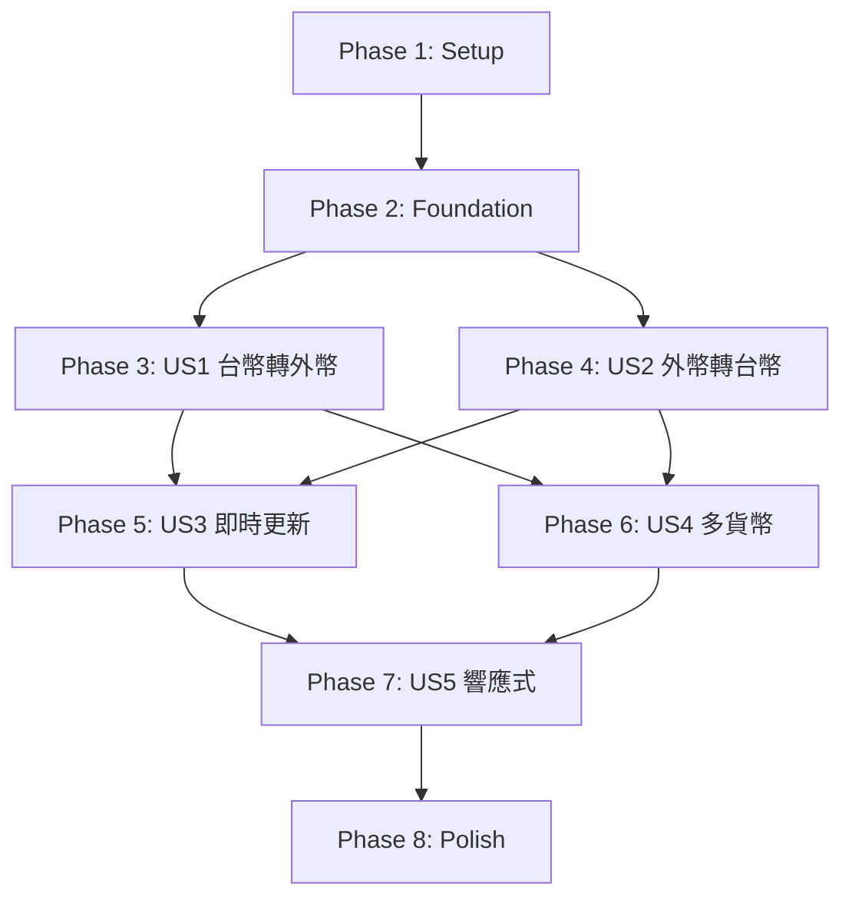

# Tasks: 台幣與外幣匯率計算器

**Input**: Design documents from `/specs/004-currency-converter/`
**Prerequisites**: plan.md, spec.md, research.md, data-model.md, contracts/

**Tests**: Following TDD workflow as specified in Constitution Check

**Organization**: Tasks are grouped by user story to enable independent implementation and testing of each story.

## Format: `[ID] [Story] Description`

- **[Story]**: Which user story this task belongs to (e.g., US1, US2, US3)
- Include exact file paths in descriptions

---

## Implementation Strategy

**MVP Scope**: User Story 1 (台幣轉外幣匯率計算) + User Story 2 (外幣轉台幣匯率計算)

這兩個 P1 優先級故事提供核心的雙向匯率計算功能，可獨立交付價值。

**Incremental Delivery**:

1. **MVP (Phase 1-4)**: 基本設定 + 資料模型 + US1 + US2
2. **Phase 5**: US3 (即時匯率更新) - 增強資料時效性
3. **Phase 6**: US4 (多貨幣支援) - 擴展貨幣範圍
4. **Phase 7**: US5 (響應式介面) - 提升使用者體驗
5. **Phase 8**: 整合測試與效能優化

---

## Dependencies & Sequential Execution

### User Story Dependencies

**Sequential Execution**: 所有任務按照 T001-T143 的順序依次執行，確保每個任務完成後再進行下一個任務。

### Independent Test Criteria

- **US1**: 輸入 1000 TWD，選擇 USD，系統顯示正確的 USD 金額（使用現金賣出匯率）
- **US2**: 輸入 100 USD，系統顯示正確的 TWD 金額（使用現金買入匯率）
- **US3**: 點擊「更新匯率」按鈕，系統從台銀 API 取得最新資料並更新時間戳記
- **US4**: 可選擇並計算七種主要貨幣（USD、JPY、CNY、EUR、GBP、HKD、AUD）
- **US5**: 在桌面、平板、手機上介面自動調整並保持可用性

---

## Phase 1: Setup (Shared Infrastructure)

**Purpose**: 專案初始化與套件安裝

**Estimated Time**: 30 分鐘

### Setup Tasks

- [ ] T001 安裝 CsvHelper 套件 (dotnet add package CsvHelper --version 30.0.1) 到 BNICalculate/BNICalculate.csproj
- [ ] T002 安裝 System.Text.Encoding.CodePages 套件 (dotnet add package System.Text.Encoding.CodePages --version 8.0.0) 到 BNICalculate/BNICalculate.csproj
- [ ] T003 安裝 Serilog.AspNetCore 套件 (dotnet add package Serilog.AspNetCore --version 8.0.0) 到 BNICalculate/BNICalculate.csproj
- [ ] T004 安裝 Serilog.Sinks.Console 套件 (dotnet add package Serilog.Sinks.Console --version 5.0.1) 到 BNICalculate/BNICalculate.csproj
- [ ] T005 安裝 Serilog.Sinks.File 套件 (dotnet add package Serilog.Sinks.File --version 5.0.0) 到 BNICalculate/BNICalculate.csproj
- [ ] T006 建立 App_Data/currency 目錄結構
- [ ] T007 在 BNICalculate/Program.cs 註冊 Serilog (包含 Console 和 File 輸出，7天滾動日誌)
- [ ] T008 在 BNICalculate/Program.cs 註冊 Big5 編碼 (Encoding.RegisterProvider)
- [ ] T009 在 BNICalculate/Program.cs 註冊 HttpClient (BaseAddress: rate.bot.com.tw, Timeout: 15秒)
- [ ] T010 在 BNICalculate/Program.cs 註冊 IMemoryCache
- [ ] T011 建立測試目錄結構 BNICalculate.Tests/Unit/Models/, BNICalculate.Tests/Unit/Services/, BNICalculate.Tests/Integration/Pages/

**Completion Criteria**: 所有套件安裝完成，Program.cs 設定就緒，目錄結構建立完成

---

## Phase 2: Foundation (Core Data Models)

**Purpose**: 建立核心資料模型與驗證規則

**Estimated Time**: 2 小時

**Test-First Approach**: 每個模型先建立測試，確認驗證規則後再實作

### ExchangeRate 模型 (TDD)

- [ ] T012 建立 BNICalculate.Tests/Unit/Models/ExchangeRateTests.cs 測試類別
- [ ] T013 撰寫 ExchangeRate 驗證測試 (CurrencyCode 必須3個大寫字母, CashBuyRate/CashSellRate >0, LastUpdated 必填)
- [ ] T014 建立 BNICalculate/Models/ExchangeRate.cs 並實作 (包含 XML 註解、Data Annotations)
- [ ] T015 執行測試確認 ExchangeRate 驗證規則正確

### ExchangeRateData 模型 (TDD)

- [ ] T016 建立 BNICalculate.Tests/Unit/Models/ExchangeRateDataTests.cs 測試類別
- [ ] T017 撰寫 ExchangeRateData 測試 (Rates 至少1筆, LastFetchTime 不可未來, IsStale() 方法測試)
- [ ] T018 建立 BNICalculate/Models/ExchangeRateData.cs 並實作 (包含 IsStale() 業務邏輯方法)
- [ ] T019 執行測試確認 ExchangeRateData 功能正確

### Currency 列舉

- [ ] T020 建立 BNICalculate/Models/Currency.cs 列舉 (USD, JPY, CNY, EUR, GBP, HKD, AUD + Display 屬性)

### CalculationRequest 模型 (TDD)

- [ ] T021 建立 BNICalculate.Tests/Unit/Models/CalculationRequestTests.cs 測試類別
- [ ] T022 撰寫 CalculationRequest 驗證測試 (Amount >0, CurrencyCode 必填, IsValid() 方法測試)
- [ ] T023 建立 BNICalculate/Models/CalculationRequest.cs 並實作
- [ ] T024 執行測試確認 CalculationRequest 驗證正確

### CalculationResult 模型 (TDD)

- [ ] T025 建立 BNICalculate.Tests/Unit/Models/CalculationResultTests.cs 測試類別
- [ ] T026 撰寫 CalculationResult 測試 (GetFormattedResult() 格式化輸出測試, 小數點6位測試)
- [ ] T027 建立 BNICalculate/Models/CalculationResult.cs 並實作 (包含 GetFormattedResult() 方法)
- [ ] T028 執行測試確認 CalculationResult 格式化正確

### 自訂例外類別

- [ ] T029 建立 BNICalculate/Models/ExternalServiceException.cs (台銀 API 呼叫失敗)
- [ ] T030 建立 BNICalculate/Models/DataFormatException.cs (CSV/JSON 格式錯誤)

**Completion Criteria**: 所有模型建立完成，所有單元測試通過（100% 覆蓋率）

---

## Phase 3: User Story 1 - 台幣轉外幣匯率計算 (P1)

**User Story**: 作為使用者，我想要輸入台幣金額並選擇目標外幣，系統能立即顯示可兌換的外幣金額

**Independent Test**: 輸入 1000 TWD，選擇 USD，系統顯示正確的 USD 金額（使用現金賣出匯率，保留6位小數）

**Estimated Time**: 3 小時

### CurrencyDataService (資料存取層) - TDD

- [ ] T031 [US1] 建立 BNICalculate/Services/ICurrencyDataService.cs 介面 (LoadAsync, SaveAsync, ExistsAsync, GetLastModifiedTimeAsync)
- [ ] T032 [US1] 建立 BNICalculate.Tests/Unit/Services/CurrencyDataServiceTests.cs 測試類別
- [ ] T033 [US1] 撰寫 LoadAsync 測試 (JSON 檔案存在返回資料, 不存在返回 null, 格式錯誤拋出 DataFormatException)
- [ ] T034 [US1] 撰寫 SaveAsync 測試 (原子寫入測試, 目錄自動建立測試)
- [ ] T035 [US1] 撰寫 ExistsAsync 和 GetLastModifiedTimeAsync 測試
- [ ] T036 [US1] 實作 BNICalculate/Services/CurrencyDataService.cs (使用 System.Text.Json, 原子寫入 .tmp 檔案)
- [ ] T037 [US1] 執行測試確認 CurrencyDataService 功能正確

### CurrencyService (業務邏輯層) - TDD

- [ ] T038 [US1] 建立 BNICalculate/Services/ICurrencyService.cs 介面 (CalculateTwdToForeignAsync, GetRatesAsync, IsDataStaleAsync 方法)
- [ ] T039 [US1] 建立 BNICalculate.Tests/Unit/Services/CurrencyServiceTests.cs 測試類別
- [ ] T040 [US1] 撰寫 CalculateTwdToForeignAsync 測試 (正常計算, 金額為0或負數拋出 ArgumentException, 不支援的貨幣拋出 ArgumentException, decimal 精度測試)
- [ ] T041 [US1] 撰寫 GetRatesAsync 測試 (快取命中, 快取未命中從檔案載入, 無資料返回 null)
- [ ] T042 [US1] 實作 BNICalculate/Services/CurrencyService.cs (CalculateTwdToForeignAsync 使用 CashSellRate, Math.Round 6位小數, IMemoryCache 30分鐘滑動過期)
- [ ] T043 [US1] 執行測試確認 CalculateTwdToForeignAsync 計算正確 (包含精度測試)

### Razor Page (展示層) - TDD

- [ ] T044 [US1] 建立 BNICalculate/Pages/CurrencyConverter.cshtml.cs PageModel (OnGet, OnPostCalculateTwdToForeignAsync 方法)
- [ ] T045 [US1] 實作 OnPostCalculateTwdToForeignAsync (呼叫 CurrencyService, 處理例外顯示 ModelState 錯誤)
- [ ] T046 [US1] 建立 BNICalculate/Pages/CurrencyConverter.cshtml Razor 頁面 (台幣轉外幣表單, 金額輸入框, 貨幣下拉選單, 計算按鈕, 結果顯示區)
- [ ] T047 [US1] 在 BNICalculate/Program.cs 註冊 ICurrencyService 和 ICurrencyDataService (Scoped 生命週期)
- [ ] T048 [US1] 建立 BNICalculate.Tests/Integration/Pages/CurrencyConverterPageTests.cs 整合測試
- [ ] T049 [US1] 撰寫頁面載入測試 (GET /CurrencyConverter 返回 200, 包含表單元素)
- [ ] T050 [US1] 撰寫台幣轉外幣 POST 測試 (模擬表單提交, 驗證計算結果顯示)
- [ ] T051 [US1] 執行整合測試確認 US1 端到端流程正確

### 樣式與客戶端驗證

- [ ] T052 [US1] 建立 BNICalculate/wwwroot/css/currency-converter.css (Bootstrap 5 基礎樣式, 表單佈局, 結果顯示卡片)
- [ ] T053 [US1] 建立 BNICalculate/wwwroot/js/currency-converter.js (jQuery Validation 客戶端驗證, 金額輸入格式化)
- [ ] T054 [US1] 在 BNICalculate/Pages/Shared/_Layout.cshtml 新增導覽連結到 /CurrencyConverter

**Completion Criteria**:

- ✅ 使用者可輸入台幣金額，選擇目標外幣（USD），點擊計算顯示外幣金額
- ✅ 計算使用現金賣出匯率，結果保留小數點後6位
- ✅ 輸入 0 或負數顯示錯誤訊息「金額必須為正數」
- ✅ 所有單元測試通過（服務層覆蓋率 >80%）
- ✅ 整合測試通過（端到端流程）

---

## Phase 4: User Story 2 - 外幣轉台幣匯率計算 (P1)

**User Story**: 作為使用者，我想要輸入外幣金額並選擇來源外幣，系統能立即顯示可兌換的台幣金額

**Independent Test**: 輸入 100 USD，系統顯示正確的 TWD 金額（使用現金買入匯率，保留6位小數）

**Estimated Time**: 2 小時

### 擴充 CurrencyService (業務邏輯層) - TDD

- [ ] T055 [US2] 在 ICurrencyService 介面新增 CalculateForeignToTwdAsync 方法簽章
- [ ] T056 [US2] 在 CurrencyServiceTests 撰寫 CalculateForeignToTwdAsync 測試 (正常計算, 來源與目標貨幣相同拋出 ArgumentException, decimal 精度測試)
- [ ] T057 [US2] 在 CurrencyService 實作 CalculateForeignToTwdAsync (使用 CashBuyRate, Math.Round 6位小數)
- [ ] T058 [US2] 執行測試確認 CalculateForeignToTwdAsync 計算正確

### 擴充 Razor Page (展示層) - TDD

- [ ] T059 [US2] 在 CurrencyConverter.cshtml.cs 新增 OnPostCalculateForeignToTwdAsync 方法
- [ ] T060 [US2] 在 CurrencyConverter.cshtml 新增外幣轉台幣表單 (外幣金額輸入框, 來源貨幣下拉選單, 計算按鈕)
- [ ] T061 [US2] 實作表單提交處理 (呼叫 CurrencyService, 驗證來源與目標貨幣不同)
- [ ] T062 [US2] 在 CurrencyConverterPageTests 撰寫外幣轉台幣 POST 測試
- [ ] T063 [US2] 撰寫來源與目標貨幣相同錯誤測試 (顯示「來源與目標貨幣不能相同」)
- [ ] T064 [US2] 執行整合測試確認 US2 端到端流程正確

### 樣式更新

- [ ] T065 [US2] 更新 currency-converter.css (新增外幣轉台幣表單樣式, 雙欄佈局)
- [ ] T066 [US2] 更新 currency-converter.js (新增外幣轉台幣客戶端驗證, 來源與目標貨幣相同檢查)

**Completion Criteria**:

- ✅ 使用者可輸入外幣金額（USD），系統顯示台幣金額
- ✅ 計算使用現金買入匯率，結果保留小數點後6位
- ✅ 選擇相同來源與目標貨幣顯示錯誤訊息
- ✅ 所有單元測試通過
- ✅ 整合測試通過

---

## Phase 5: User Story 3 - 即時匯率更新 (P2)

**User Story**: 作為使用者，我想要看到匯率資料的最後更新時間，並能手動觸發更新，確保使用最新的匯率資料進行計算

**Independent Test**: 點擊「更新匯率」按鈕，系統從台銀 API 取得最新資料，顯示更新時間，資料可用於後續計算

**Estimated Time**: 4 小時

### 台銀 API 整合 - TDD

- [ ] T067 [US3] 建立 BNICalculate/Models/TaiwanBankCsvRecord.cs (CsvHelper 映射類別, 包含貨幣代碼、現金買入、現金賣出欄位)
- [ ] T068 [US3] 在 CurrencyServiceTests 撰寫 FetchAndUpdateRatesAsync 測試 (模擬 HttpClient 回應 Big5 CSV, 驗證解析正確)
- [ ] T069 [US3] 撰寫 FetchAndUpdateRatesAsync 錯誤測試 (API 逾時拋出 ExternalServiceException, 404 錯誤, 503 錯誤)
- [ ] T070 [US3] 撰寫 CSV 格式驗證測試 (欄位缺失拋出 DataFormatException, 匯率為空值跳過該筆)
- [ ] T071 [US3] 在 ICurrencyService 介面新增 FetchAndUpdateRatesAsync 方法簽章
- [ ] T072 [US3] 在 CurrencyService 實作 FetchAndUpdateRatesAsync (HttpClient GET, Big5 解碼, CsvHelper 解析, 寫入 JSON 檔案, 更新快取)
- [ ] T073 [US3] 執行測試確認 FetchAndUpdateRatesAsync 功能正確 (包含錯誤處理)

### 資料時效性檢查 - TDD

- [ ] T074 [US3] 在 CurrencyServiceTests 撰寫 IsDataStaleAsync 測試 (無資料返回 true, 資料<24h 返回 false, 資料>24h 返回 true)
- [ ] T075 [US3] 在 CurrencyService 實作 IsDataStaleAsync (檢查 LastFetchTime 距離現在超過24小時)
- [ ] T076 [US3] 執行測試確認 IsDataStaleAsync 正確

### Razor Page 更新功能 - TDD

- [ ] T077 [US3] 在 CurrencyConverter.cshtml.cs 新增 OnGetAsync 方法 (檢查資料存在, 無資料自動呼叫 FetchAndUpdateRatesAsync)
- [ ] T078 [US3] 在 CurrencyConverter.cshtml.cs 新增 OnPostUpdateRatesAsync 方法 (手動更新, 處理 ExternalServiceException 顯示錯誤)
- [ ] T079 [US3] 在 CurrencyConverter.cshtml 新增匯率資訊顯示區 (當前日期含星期, 最後更新時間, 更新匯率按鈕)
- [ ] T080 [US3] 在 CurrencyConverter.cshtml 新增資料過期警告顯示邏輯 (IsDataStale 為 true 顯示警告訊息)
- [ ] T081 [US3] 在 CurrencyConverterPageTests 撰寫首次載入自動更新測試 (無本地資料時自動呼叫 API)
- [ ] T082 [US3] 撰寫手動更新按鈕測試 (POST /CurrencyConverter?handler=UpdateRates, 驗證更新成功)
- [ ] T083 [US3] 撰寫 API 失敗降級測試 (API 失敗時使用快取資料, 顯示錯誤訊息)
- [ ] T084 [US3] 執行整合測試確認 US3 端到端流程正確

### 載入狀態與防重複請求

- [ ] T085 [US3] 更新 currency-converter.js (點擊更新按鈕顯示載入動畫, 停用按鈕30秒防重複請求)
- [ ] T086 [US3] 更新 currency-converter.css (新增載入動畫樣式, 停用按鈕樣式)

**Completion Criteria**:

- ✅ 首次載入無本地資料時自動從台銀 API 取得匯率
- ✅ 頁面顯示當前日期（含星期）及最後更新時間
- ✅ 使用者可點擊「更新匯率」按鈕手動更新
- ✅ 資料超過24小時顯示警告訊息
- ✅ API 無法連線時顯示錯誤訊息並使用快取資料
- ✅ 更新進行中顯示載入動畫並停用按鈕
- ✅ 所有單元測試通過（含錯誤處理場景）
- ✅ 整合測試通過

---

## Phase 6: User Story 4 - 多貨幣支援 (P2)

**User Story**: 作為使用者，我想要從多種主要外幣中選擇，進行匯率計算，滿足不同國家旅遊或交易需求

**Independent Test**: 可選擇 USD、JPY、CNY、EUR、GBP、HKD、AUD 七種貨幣，每種都能正常計算

**Estimated Time**: 2 小時

### 多貨幣驗證測試

- [ ] T087 [US4] 在 CurrencyServiceTests 撰寫七種貨幣計算測試 (USD, JPY, CNY, EUR, GBP, HKD, AUD 各一個測試案例)
- [ ] T088 [US4] 撰寫不支援貨幣錯誤測試 (輸入 XXX 拋出 ArgumentException)
- [ ] T089 [US4] 執行測試確認所有貨幣計算正確

### 貨幣選單更新

- [ ] T090 [US4] 在 CurrencyConverter.cshtml 更新貨幣下拉選單 (七種貨幣含中文名稱顯示)
- [ ] T091 [US4] 在 Currency 列舉新增 Display 屬性 (中文名稱：美元、日圓、人民幣、歐元、英鎊、港幣、澳幣)
- [ ] T092 [US4] 在 CurrencyConverterPageTests 撰寫多貨幣整合測試 (每種貨幣各測試一次台幣轉外幣和外幣轉台幣)
- [ ] T093 [US4] 執行整合測試確認七種貨幣端到端流程正確

### CSV 解析貨幣映射

- [ ] T094 [US4] 更新 TaiwanBankCsvRecord 映射 (確保七種貨幣代碼正確映射到 CSV 欄位)
- [ ] T095 [US4] 在 CurrencyService 實作貨幣代碼標準化邏輯 (處理可能的 CSV 格式差異)

**Completion Criteria**:

- ✅ 下拉選單顯示七種貨幣（含中文名稱）
- ✅ 每種貨幣都能正常進行雙向計算
- ✅ 不支援的貨幣顯示錯誤訊息
- ✅ 所有七種貨幣的單元測試通過
- ✅ 整合測試涵蓋所有貨幣

---

## Phase 7: User Story 5 - 響應式介面與即時回饋 (P3)

**User Story**: 作為使用者，我想要在桌面和手機上都能流暢使用匯率計算器，並在輸入時獲得即時的格式提示和回饋

**Independent Test**: 在不同裝置（桌面、平板、手機）開啟系統，介面自動調整並保持可用性；輸入無效資料即時顯示提示

**Estimated Time**: 3 小時

### 響應式佈局

- [ ] T096 [US5] 更新 currency-converter.css 實作響應式 Grid 佈局 (桌面2欄, 平板2欄, 手機1欄)
- [ ] T097 [US5] 實作手機優化樣式 (按鈕加大, 輸入框加大, 觸控友善間距)
- [ ] T098 [US5] 實作桌面優化樣式 (多欄佈局, 固定寬度容器)
- [ ] T099 [US5] 在 CurrencyConverter.cshtml 新增 viewport meta 標籤
- [ ] T100 [US5] 測試響應式斷點 (使用瀏覽器開發者工具測試 320px, 768px, 1024px, 1920px 寬度)

### 即時驗證與回饋

- [ ] T101 [US5] 更新 currency-converter.js 實作即時格式驗證 (輸入非數字顯示提示, 離開輸入框觸發)
- [ ] T102 [US5] 實作金額格式化 (自動加入千分位逗號, 限制小數位數)
- [ ] T103 [US5] 實作載入狀態管理 (更新匯率時停用計算按鈕, 顯示 Spinner)
- [ ] T104 [US5] 在 CurrencyConverter.cshtml 新增客戶端驗證錯誤顯示區塊
- [ ] T105 [US5] 測試即時驗證 (輸入 "abc", "-100", 空值, 超大數值)

### 無障礙優化

- [ ] T106 [US5] 在 CurrencyConverter.cshtml 新增 ARIA 標籤 (aria-label, aria-describedby, role)
- [ ] T107 [US5] 實作鍵盤導航支援 (Tab 順序正確, Enter 提交表單)
- [ ] T108 [US5] 測試螢幕閱讀器相容性 (使用 VoiceOver 或 NVDA 測試)

### 跨瀏覽器測試

- [ ] T109 [US5] 在 Chrome 測試所有功能
- [ ] T110 [US5] 在 Firefox 測試所有功能
- [ ] T111 [US5] 在 Safari 測試所有功能
- [ ] T112 [US5] 在 Edge 測試所有功能
- [ ] T113 [US5] 在行動裝置實機測試 (iOS Safari, Android Chrome)

**Completion Criteria**:

- ✅ 在桌面、平板、手機上介面自動調整
- ✅ 輸入無效資料即時顯示格式提示
- ✅ 更新匯率時顯示載入動畫並停用計算按鈕
- ✅ 所有主要瀏覽器功能正常
- ✅ 行動裝置實機測試通過
- ✅ 鍵盤導航與螢幕閱讀器支援

---

## Phase 8: Polish & Integration

**Purpose**: 整合測試、效能優化、文件完善

**Estimated Time**: 3 小時

### 整合測試與邊界案例

- [ ] T114 建立 BNICalculate.Tests/Integration/Scenarios/CurrencyConverterScenariosTests.cs
- [ ] T115 撰寫完整使用者旅程測試 (載入頁面 → 更新匯率 → 台幣轉外幣 → 外幣轉台幣)
- [ ] T116 撰寫極大金額測試 (超過 decimal 處理範圍, 驗證錯誤訊息)
- [ ] T117 撰寫 CSV 格式變更測試 (模擬欄位順序改變, 驗證錯誤處理)
- [ ] T118 撰寫並行更新測試 (模擬多使用者同時更新匯率, 驗證最後寫入勝出)
- [ ] T119 撰寫快取機制測試 (30分鐘內重複請求使用快取, 驗證 API 呼叫次數)
- [ ] T120 執行所有測試確認覆蓋率 >80% (使用 dotnet test --collect:"XPlat Code Coverage")

### 效能優化

- [ ] T121 在 BNICalculate/Program.cs 啟用回應壓縮 (AddResponseCompression, EnableForHttps)
- [ ] T122 在 BNICalculate/Program.cs 設定靜態檔案快取 (Cache-Control: public,max-age=3600)
- [ ] T123 測試頁面載入時間 <2 秒 (使用 Chrome DevTools Performance)
- [ ] T124 測試計算回應時間 <3 秒 (從點擊按鈕到顯示結果)
- [ ] T125 測試 API 更新時間 <15 秒 (從點擊更新到完成)
- [ ] T126 壓力測試系統負載 1000 次/小時 (使用 k6 或 Apache Bench)

### 錯誤處理與日誌

- [ ] T127 檢查所有 try-catch 區塊包含適當的錯誤訊息
- [ ] T128 檢查所有錯誤訊息使用繁體中文
- [ ] T129 驗證 Serilog 日誌記錄完整 (API 失敗、驗證錯誤、資料過期警告、CSV 格式異常)
- [ ] T130 檢查 logs/ 目錄日誌滾動正常 (7天保留)

### 安全性檢查

- [ ] T131 驗證 App_Data/currency/rates.json 不在 wwwroot 下 (避免直接 HTTP 存取)
- [ ] T132 檢查使用者輸入驗證完整 (金額、貨幣代碼、防 XSS)
- [ ] T133 驗證 HTTPS 重導向啟用 (Production 環境)
- [ ] T134 檢查 CORS 設定 (若需要)

### 文件與免責聲明

- [ ] T135 在 CurrencyConverter.cshtml 新增免責聲明 (頁面底部：「本匯率僅供參考，實際交易請以銀行公告為準」)
- [ ] T136 更新 README.md 新增匯率計算器功能說明
- [ ] T137 建立 BNICalculate/docs/currency-converter-guide.md 使用者指南
- [ ] T138 更新 BNICalculate/appsettings.json 新增 CurrencyConverter 設定區段 (快取時間、API 逾時等)

### 最終驗收

- [ ] T139 執行所有自動化測試 (Unit + Integration)
- [ ] T140 執行手動測試檢查表 (所有使用者故事的驗收情境)
- [ ] T141 驗證所有成功標準達成 (SC-001 至 SC-010)
- [ ] T142 提交 Pull Request 到主分支
- [ ] T143 建立 Git Tag v1.0.0-currency-converter

**Completion Criteria**:

- ✅ 所有自動化測試通過（覆蓋率 >80%）
- ✅ 所有邊界案例處理正確
- ✅ 效能指標達成（頁面載入 <2s, 計算 <3s, API <15s）
- ✅ 壓力測試通過（1000 req/hour）
- ✅ 錯誤處理與日誌記錄完整
- ✅ 安全性檢查通過
- ✅ 文件與免責聲明完整
- ✅ 所有成功標準驗證通過

---

## Task Summary

**Total Tasks**: 143

**Task Count by Phase**:

- Phase 1 (Setup): 11 tasks (30 min)
- Phase 2 (Foundation): 19 tasks (2 hours)
- Phase 3 (US1): 24 tasks (3 hours)
- Phase 4 (US2): 12 tasks (2 hours)
- Phase 5 (US3): 19 tasks (4 hours)
- Phase 6 (US4): 9 tasks (2 hours)
- Phase 7 (US5): 18 tasks (3 hours)
- Phase 8 (Polish): 31 tasks (3 hours)

**Estimated Total Time**: 19.5 小時

**Sequential Execution**: 所有 143 個任務按順序執行，無並行處理

**MVP Scope (Phases 1-4)**: 66 tasks (7.5 hours) - 包含雙向匯率計算核心功能

---

## Validation Checklist

- ✅ All tasks follow checkbox format: `- [ ] [ID] [Story?] Description`
- ✅ All task IDs are sequential (T001-T143)
- ✅ All user story tasks include [US#] label
- ✅ All tasks include exact file paths
- ✅ Tasks organized by user story (5 user stories mapped)
- ✅ Each user story has independent test criteria
- ✅ TDD workflow: Tests before implementation (following Constitution Check)
- ✅ Dependencies documented with mermaid diagram
- ✅ Sequential execution: All tasks execute in order (T001-T143)
- ✅ MVP scope defined (Phases 1-4)
- ✅ Format validation complete

---

## Notes

- 本任務清單遵循 TDD 工作流程，所有業務邏輯先撰寫測試再實作
- 覆蓋率目標：服務層 >80%，關鍵邏輯（計算、匯率更新）100%
- 所有錯誤訊息使用繁體中文
- 使用 Serilog 記錄結構化日誌（錯誤與警告層級）
- 30 分鐘記憶體快取減少 API 請求次數
- 使用 Big5 編碼處理台銀 CSV API
- decimal 型別確保金額計算精確（6 位小數）
- Bootstrap 5 響應式設計支援桌面、平板、手機
